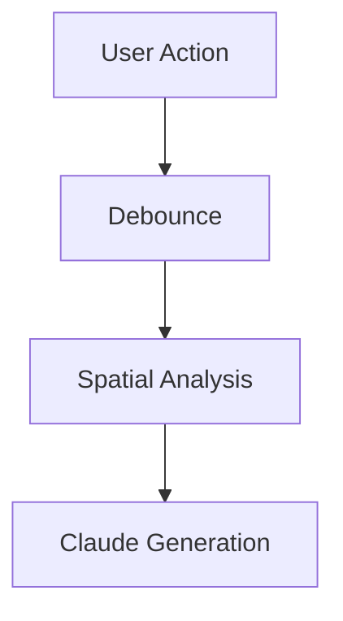

# Technology Stack

**Project:** Obsidian Canvas AI
**Researched:** 2026-04-02

## Recommended Stack

### Core Platform

| Technology | Version | Purpose | Why | Confidence |
|------------|---------|---------|-----|------------|
| Obsidian Plugin API (`obsidian`) | ^1.12.3 | Plugin framework, workspace access, vault I/O | Official API; provides Plugin lifecycle, PluginSettingTab, requestUrl, Vault read/write, Workspace events. This is non-negotiable. | HIGH |
| TypeScript | ^5.5 | Language | Obsidian sample plugin uses TS. Required for type safety with undocumented canvas internals. | HIGH |
| esbuild | ^0.24 | Bundler | Official Obsidian sample plugin uses esbuild. Fast, simple, proven pattern. Do NOT use webpack/vite/rollup. | HIGH |
| Node.js | ^20 LTS | Dev runtime | Required by esbuild and the Anthropic SDK. Use LTS only. | HIGH |

### AI / LLM Integration

| Technology | Version | Purpose | Why | Confidence |
|------------|---------|---------|-----|------------|
| `@anthropic-ai/sdk` | ^0.82.0 | Claude Opus 4.6 API calls | Official Anthropic TypeScript SDK. Supports streaming via SSE, custom fetch injection, dual CJS/ESM. **Critical:** Must configure `dangerouslyAllowBrowser: true` since Obsidian runs in Electron (browser-like env). Better: inject Node.js `fetch` as custom fetch to bypass CORS entirely. | HIGH |

**Streaming architecture note:** Obsidian's built-in `requestUrl()` does NOT support streaming responses -- it buffers the full response before returning. This is a confirmed limitation as of March 2026. For SSE streaming (required for progressive content rendering), you MUST use the Anthropic SDK with Node.js fetch directly in Electron's Node context, NOT through Obsidian's `requestUrl`. Since we target desktop only and Obsidian runs on Electron with full Node.js access, this is viable.

### Image Generation

| Technology | Version | Purpose | Why | Confidence |
|------------|---------|---------|-----|------------|
| `@runware/sdk-js` | ^1.2.3 | Runware API client for Riverflow 2.0 Pro | Official Runware JS/TS SDK. WebSocket-based with auto-reconnect, Promise API, TypeScript types included. Supports text-to-image, image-to-image, inpainting. Returns images as URL, base64, or dataURI. | HIGH |

**Riverflow 2.0 Pro model ID:** `sourceful:2@3` (AIR code format). Other Riverflow variants available: Fast (`sourceful:2@2`), Standard (`sourceful:2@1`).

**Image delivery pattern:** Use `outputFormat: "base64Data"` or `outputFormat: "URL"` depending on context. For canvas embedding, base64 avoids external URL dependency. For vault storage, download URL content and save as vault file, then reference as file node.

### Canvas Interaction (Internal APIs)

| Technology | Version | Purpose | Why | Confidence |
|------------|---------|---------|-----|------------|
| `obsidian-typings` | ^4.88.0 | Type definitions for undocumented Obsidian internals | Community-maintained TS definitions for Canvas internals (CanvasView, Canvas, CanvasNode, etc.). Based on reverse engineering -- types may drift between Obsidian versions. Essential for type-safe access to undocumented canvas APIs. | MEDIUM |
| `monkey-around` | ^3.0.0 | Safe monkey-patching of canvas methods | De-duplicated, uninstallable patches. Used by Advanced Canvas and other major canvas plugins. Essential for intercepting canvas events (node create, move, edit, delete). | MEDIUM |

**Canvas access pattern (established community convention):**
```typescript
import { ItemView } from "obsidian";

// Get active canvas (undocumented internal API)
const canvasView = this.app.workspace.getActiveViewOfType(ItemView);
if (canvasView?.getViewType() === "canvas") {
  // @ts-ignore -- or use obsidian-typings for typed access
  const canvas = canvasView.canvas;

  // canvas.nodes: Map<string, CanvasNode>
  // canvas.edges: Map<string, CanvasEdge>
  // canvas.getData(): CanvasData
  // canvas.setData(data): void
  // canvas.requestSave(): void
  // canvas.createTextNode(options): CanvasNode
}
```

**Canvas event interception via monkey-around:**
```typescript
import { around } from "monkey-around";

// Patch canvas prototype methods to intercept events
const uninstall = around(canvas.constructor.prototype, {
  addNode: (next) => function(...args) {
    const result = next.call(this, ...args);
    // React to node addition
    return result;
  }
});

// Clean up on plugin unload
this.register(uninstall);
```

**Alternative: Canvas file manipulation (more stable, less real-time):**
```typescript
// Read canvas as JSON
const file = this.app.vault.getAbstractFileByPath("path/to/canvas.canvas");
const content = await this.app.vault.read(file);
const canvasData: CanvasData = JSON.parse(content);

// Add a node
canvasData.nodes.push({
  id: generateId(),
  type: "text",
  text: "AI generated content",
  x: 100, y: 200,
  width: 400, height: 300
});

// Write back
await this.app.vault.modify(file, JSON.stringify(canvasData));
```

### Supporting Libraries

| Library | Version | Purpose | When to Use | Confidence |
|---------|---------|---------|-------------|------------|
| `uuid` | ^9.0 | Unique ID generation for canvas nodes | Every generated node needs a unique ID within its canvas file | HIGH |
| `zod` | ^3.25 | Runtime type validation | Validate Claude API responses, parse structured output, validate settings | MEDIUM |

### NOT Recommended / Explicitly Excluded

| Library | Why Not |
|---------|---------|
| `mermaid` (npm package) | Obsidian ships with Mermaid built-in. Use Obsidian's native Mermaid rendering by generating mermaid code blocks in text nodes. Do NOT bundle a separate Mermaid library. |
| `axios` / `node-fetch` (as primary HTTP) | Use `@anthropic-ai/sdk` with custom fetch for Claude calls. Use `@runware/sdk-js` for Runware (WebSocket-based). Use Obsidian's `requestUrl()` for any other HTTP needs. No need for generic HTTP libraries. |
| `react` / `svelte` / `vue` | Obsidian plugins use vanilla DOM manipulation or Obsidian's built-in Component/Setting APIs for UI. Framework overhead is unnecessary and complicates the build. |
| `webpack` / `vite` / `rollup` | esbuild is the official Obsidian plugin build tool. Others add complexity with no benefit. |
| `@runware/ai-sdk-provider` | This is a Vercel AI SDK adapter for Runware. We don't use Vercel AI SDK. Use `@runware/sdk-js` directly. |
| `obsidian-canvas-event-patcher` | Git submodule approach is awkward. Use `monkey-around` directly -- it's the same underlying technique with better ergonomics. |

## Build Configuration

### esbuild.config.mjs (follows official Obsidian sample plugin pattern)

```javascript
import esbuild from "esbuild";
import process from "process";
import builtins from "builtin-modules";

const banner = `/* THIS IS A GENERATED FILE. DO NOT EDIT DIRECTLY. */`;
const prod = process.argv[2] === "production";

const context = await esbuild.context({
  banner: { js: banner },
  entryPoints: ["src/main.ts"],
  bundle: true,
  external: [
    "obsidian",
    "electron",
    "@codemirror/autocomplete",
    "@codemirror/collab",
    "@codemirror/commands",
    "@codemirror/language",
    "@codemirror/lint",
    "@codemirror/search",
    "@codemirror/state",
    "@codemirror/view",
    "@lezer/common",
    "@lezer/highlight",
    "@lezer/lr",
    ...builtins,
  ],
  format: "cjs",
  target: "es2018",
  logLevel: "info",
  sourcemap: prod ? false : "inline",
  treeShaking: true,
  outfile: "main.js",
  minify: prod,
});

if (prod) {
  await context.rebuild();
  process.exit(0);
} else {
  await context.watch();
}
```

**Key bundling notes:**
- `obsidian` and `electron` are external -- provided by Obsidian at runtime.
- `@codemirror/*` and `@lezer/*` are external -- Obsidian's editor stack, provided at runtime.
- Node.js builtins are external -- available in Electron's Node context.
- `@anthropic-ai/sdk` and `@runware/sdk-js` WILL be bundled (they are NOT external). esbuild handles their CJS/ESM compilation.

### tsconfig.json

```json
{
  "compilerOptions": {
    "baseUrl": ".",
    "inlineSourceMap": true,
    "inlineSources": true,
    "module": "ESNext",
    "target": "ES6",
    "allowJs": true,
    "noImplicitAny": true,
    "strictNullChecks": true,
    "moduleResolution": "node",
    "importHelpers": true,
    "isolatedModules": true,
    "strictFunctionTypes": true,
    "lib": ["DOM", "ES5", "ES6", "ES7"]
  },
  "include": ["src/**/*.ts"]
}
```

### package.json (dependencies)

```json
{
  "devDependencies": {
    "obsidian": "^1.12.3",
    "obsidian-typings": "^4.88.0",
    "typescript": "^5.5.0",
    "esbuild": "^0.24.0",
    "builtin-modules": "^4.0.0",
    "@types/node": "^20.0.0",
    "eslint": "^9.0.0"
  },
  "dependencies": {
    "@anthropic-ai/sdk": "^0.82.0",
    "@runware/sdk-js": "^1.2.3",
    "monkey-around": "^3.0.0",
    "uuid": "^9.0.0",
    "zod": "^3.25.0"
  }
}
```

**Note:** `obsidian` is a devDependency only -- it provides type definitions for development. At runtime, Obsidian injects the API.

### Project Structure

```
obsidian-canvas-ai/
  src/
    main.ts                  # Plugin entry point (onload/onunload)
    settings.ts              # PluginSettingTab + settings interface
    canvas/
      canvas-watcher.ts      # Monkey-patch canvas events, detect idle
      canvas-reader.ts       # Read spatial state: nodes, positions, proximity
      canvas-writer.ts       # Create new nodes, place them spatially
      spatial-analyzer.ts    # Proximity/clustering algorithms
    ai/
      claude-client.ts       # Anthropic SDK wrapper with streaming
      prompt-builder.ts      # Build spatial context prompts
      response-parser.ts     # Parse Claude responses into node types
    image/
      runware-client.ts      # Runware SDK wrapper
      image-node.ts          # Create image nodes from generated images
    taste/
      taste-profile.ts       # Load/parse taste profile from markdown
    utils/
      debounce.ts            # Idle detection / debounce logic
      id.ts                  # Node ID generation
      placement.ts           # Spatial placement algorithm (avoid overlaps)
  styles.css                 # Plugin styles
  manifest.json              # Obsidian plugin manifest
  versions.json              # Version compatibility map
  esbuild.config.mjs         # Build config
  tsconfig.json              # TypeScript config
  package.json               # Dependencies
```

## Canvas Data Format Reference

The `.canvas` file format (JSON Canvas spec):

```typescript
// From obsidian-api/canvas.d.ts
interface CanvasData {
  nodes: AllCanvasNodeData[];
  edges: CanvasEdgeData[];
  [key: string]: any; // Forward compatibility
}

type AllCanvasNodeData =
  | CanvasFileData      // References a vault file
  | CanvasTextData      // Inline text/markdown
  | CanvasLinkData      // External URL
  | CanvasGroupData;    // Visual container

interface CanvasNodeData {
  id: string;
  x: number;
  y: number;
  width: number;
  height: number;
  color?: CanvasColor;  // "1"-"6" (palette) or "#RRGGBB"
}

interface CanvasTextData extends CanvasNodeData {
  type: "text";
  text: string;         // Markdown content
}

interface CanvasFileData extends CanvasNodeData {
  type: "file";
  file: string;         // Vault-relative path
  subpath?: string;     // Optional heading/block link
}

interface CanvasEdgeData {
  id: string;
  fromNode: string;
  toNode: string;
  fromSide?: "top" | "right" | "bottom" | "left";
  toSide?: "top" | "right" | "bottom" | "left";
  fromEnd?: "none" | "arrow";
  toEnd?: "none" | "arrow";
  color?: CanvasColor;
  label?: string;
}
```

## Obsidian Plugin Lifecycle

```typescript
import { Plugin, PluginSettingTab, Setting, App } from "obsidian";

export default class CanvasAIPlugin extends Plugin {
  settings: CanvasAISettings;

  async onload() {
    await this.loadSettings();
    this.addSettingTab(new CanvasAISettingTab(this.app, this));

    // Register canvas event watchers
    // Set up debounce timer
    // Initialize Claude + Runware clients
  }

  onunload() {
    // Clean up monkey patches
    // Cancel pending API calls
    // Clear debounce timers
  }

  async loadSettings() {
    this.settings = Object.assign({}, DEFAULT_SETTINGS, await this.loadData());
  }

  async saveSettings() {
    await this.saveData(this.settings);
  }
}
```

## Key Technical Decisions

### 1. Streaming: Node.js fetch in Electron, NOT requestUrl

Obsidian's `requestUrl()` buffers entire responses. For progressive rendering of Claude's output, use the Anthropic SDK's native streaming which leverages Node.js fetch available in Electron's process. This is desktop-only, which aligns with our scope (desktop only for v1).

```typescript
const client = new Anthropic({
  apiKey: settings.anthropicApiKey,
  dangerouslyAllowBrowser: true, // Required in Electron env
});

const stream = client.messages.stream({
  model: "claude-opus-4-6-20250415",
  max_tokens: 4096,
  messages: [{ role: "user", content: spatialPrompt }],
});

stream.on("text", (text) => {
  // Progressive rendering: update canvas node content as chunks arrive
});

const finalMessage = await stream.finalMessage();
```

### 2. Canvas Manipulation: Dual approach (Internal API + File I/O fallback)

- **Primary:** Monkey-patch canvas internal APIs for real-time node creation with visual feedback.
- **Fallback:** File-based JSON manipulation via `vault.modify()` for reliability.
- **Caveat:** `vault.modify()` conflicts with canvas's own `requestSave` debounce (2-second window). When canvas is actively saving, file writes may be lost. Use internal API as primary; file I/O only for batch operations or when canvas view is not active.

### 3. Image Storage: Vault files, not inline base64

Generate images via Runware, download to vault (e.g., `assets/ai-generated/`), then create `CanvasFileData` nodes pointing to the vault file. This keeps canvas files small and images reusable.

### 4. Diagram Generation: Mermaid code blocks in text nodes

Obsidian renders Mermaid natively in markdown. Generate text nodes containing mermaid code blocks:
````

````

This leverages Obsidian's built-in rendering without additional dependencies.

### 5. Taste Profile: Markdown file in vault

Store taste profiles as markdown files (e.g., `.canvas-ai/taste-profile.md`). Read with `vault.read()`. This makes profiles editable in Obsidian itself, version-controllable, and human-readable. Per-user profiles map to different files in settings.

## Alternatives Considered

| Category | Recommended | Alternative | Why Not |
|----------|-------------|-------------|---------|
| LLM SDK | `@anthropic-ai/sdk` | Raw `fetch` calls | SDK handles streaming, retries, types, error handling. Rolling your own SSE parser is error-prone. |
| Image Gen SDK | `@runware/sdk-js` | Raw WebSocket | SDK handles reconnection, auth, retry, typing. WebSocket management is complex. |
| Canvas Events | `monkey-around` patches | `obsidian-canvas-event-patcher` | monkey-around is an npm package; event-patcher requires git submodule. Same technique, better DX. |
| Canvas Types | `obsidian-typings` | `@ts-ignore` everywhere | Typed access reduces bugs and enables IDE completion. Types may drift, but better than no types. |
| Build Tool | esbuild | webpack / vite | Official Obsidian pattern. esbuild is faster and simpler. No reason to diverge. |
| UI Framework | Vanilla DOM + Obsidian API | React / Svelte | Plugin UI is settings tab + canvas nodes. Obsidian's Setting API covers settings. Canvas nodes are data, not UI components. Framework is pure overhead. |
| Diagram Rendering | Obsidian native Mermaid | Bundled mermaid.js | Obsidian already includes Mermaid. Bundling another copy wastes ~2MB and creates version conflicts. |
| HTTP Client | SDK-specific (Anthropic SDK, Runware SDK) | axios / got | Each SDK manages its own transport. No general HTTP needs remain. Obsidian's requestUrl for any edge cases. |

## Version Pinning Strategy

- Pin Obsidian API to the minimum version that supports canvas (`^1.1.0` introduced canvas). Target `^1.12.0` for current features.
- Pin `obsidian-typings` to match your target Obsidian version branch.
- Pin `@anthropic-ai/sdk` and `@runware/sdk-js` with caret (`^`) -- these are actively maintained and backward-compatible within major versions.
- Pin `monkey-around` exactly (`3.0.0`) -- breaking changes in patch utilities can be catastrophic.

## Installation

```bash
# Clone from template
npx degit obsidianmd/obsidian-sample-plugin obsidian-canvas-ai
cd obsidian-canvas-ai

# Core dependencies
npm install @anthropic-ai/sdk @runware/sdk-js monkey-around uuid zod

# Dev dependencies (obsidian types already in template)
npm install -D obsidian-typings @types/uuid

# Verify build
npm run dev
```

## Sources

- [Obsidian Sample Plugin (official template)](https://github.com/obsidianmd/obsidian-sample-plugin)
- [Obsidian API Type Definitions](https://github.com/obsidianmd/obsidian-api)
- [Obsidian Canvas Type Definitions (canvas.d.ts)](https://github.com/obsidianmd/obsidian-api/blob/master/canvas.d.ts)
- [Obsidian Developer Documentation](https://docs.obsidian.md/Home)
- [obsidian-typings (undocumented API types)](https://github.com/Fevol/obsidian-typings)
- [Obsidian Advanced Canvas Plugin (canvas internal API patterns)](https://github.com/Developer-Mike/obsidian-advanced-canvas)
- [Obsidian Link Nodes in Canvas (canvas manipulation example)](https://github.com/Quorafind/Obsidian-Link-Nodes-In-Canvas)
- [obsidian-canvas-event-patcher (monkey-patch patterns)](https://github.com/neonpalms/obsidian-canvas-event-patcher)
- [monkey-around npm](https://www.npmjs.com/package/monkey-around/v/3.0.0)
- [Anthropic TypeScript SDK](https://github.com/anthropics/anthropic-sdk-typescript)
- [@anthropic-ai/sdk npm](https://www.npmjs.com/package/@anthropic-ai/sdk)
- [Claude API Streaming Docs](https://platform.claude.com/docs/en/api/sdks/typescript)
- [Runware JS SDK](https://github.com/Runware/sdk-js)
- [@runware/sdk-js npm](https://www.npmjs.com/package/@runware/sdk-js)
- [Runware Image Inference API](https://runware.ai/docs/image-inference/api-reference)
- [Riverflow 2.0 Pro Model](https://runware.ai/models/sourceful-riverflow-2-0-pro)
- [Obsidian requestUrl streaming limitation (Forum)](https://forum.obsidian.md/t/support-streaming-the-request-and-requesturl-response-body/87381)
- [Obsidian Canvas API discussion (Forum)](https://forum.obsidian.md/t/any-details-on-the-canvas-api/57120)
- [vault.modify + requestSave conflict (Forum)](https://forum.obsidian.md/t/vault-process-and-vault-modify-dont-work-when-there-is-a-requestsave-debounce-event/107862)
- [Creating canvas programmatically (Forum)](https://forum.obsidian.md/t/creating-a-canvas-programmatically/101850)
- [Making HTTP requests in plugins (Forum)](https://forum.obsidian.md/t/make-http-requests-from-plugins/15461)
- [Obsidian Plugin Settings Pattern](https://marcusolsson.github.io/obsidian-plugin-docs/user-interface/settings)
